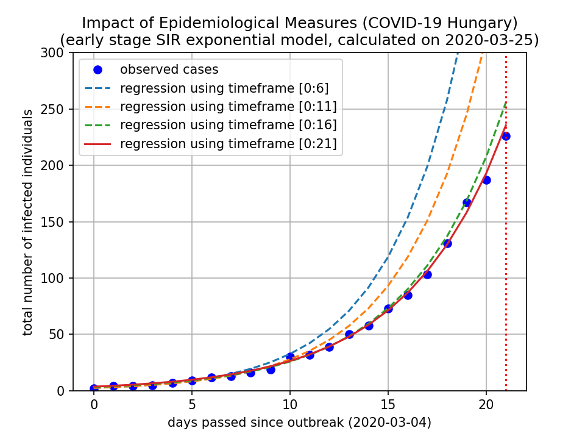
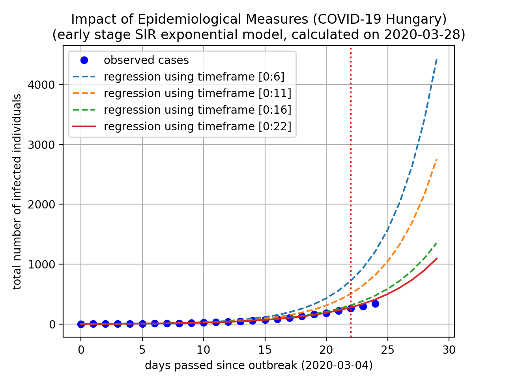

# Impact of Epidemiological Measures (COVID-19)

Regression on total number of infected individuals using
expanding timeframe ranges.

Assuming simple SIR model, using exponential approximation
during the early stage of the spreading.

Regression models seem to fit almost accurately.

Regression models for Hungary as of 2020-03-29:

Results without deeper analysis: **epidemiological measures are
significantly decreases the exponential rate**.

Here is a plot illustrating the results for Hungary. The decreasing
exponential rate should result significantly less infections in the
next days.

