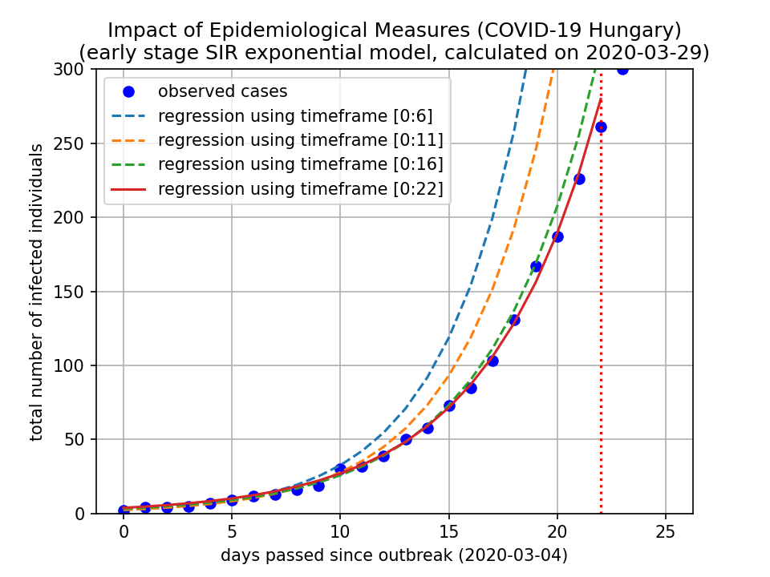

# Impact of Epidemiological Measures (COVID-19)

Regression on total number of infected individuals using
expanding timeframe ranges.

Assuming simple SIR model, using exponential approximation
during the early stage of the spreading.

Regression models seem to fit almost accurately.

Results without deeper analysis: **epidemiological measures are
significantly decreases the exponential rate**.

Here is a plot showing regressions for Hungary:

